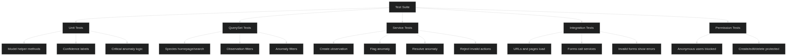
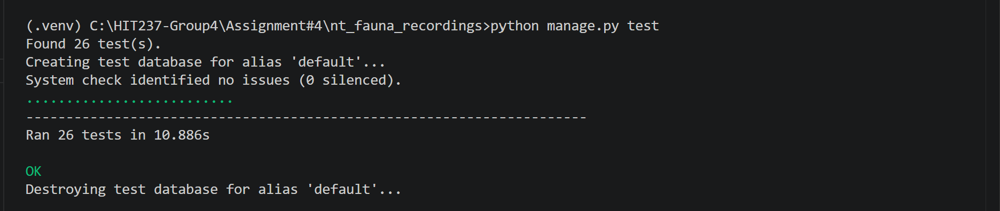

# ADR-001: Initial Testing and Exception Handling Approach

**Status:** Superseded  
**Date:** 23 May 2026

## Context

During the earlier stage of Assessment 4, the project introduced its first structured testing and exception-handling approach. At this stage, the main goal was to improve reliability beyond basic manual testing and to prevent obvious crashes during create and update operations.

The initial implementation focused mainly on making sure that models, views, and services could execute correctly under normal conditions. Basic exception handling was also introduced inside views and services to stop invalid actions from causing unhandled server errors.

## Decision

The first version of the test suite included tests for:

- Basic model behaviour
- Service-layer workflows
- View loading and URL routing
- Authentication redirects
- Basic exception handling paths

Custom service exceptions were introduced so that business-rule failures could be separated from lower-level Django or database exceptions.

Examples included:
- invalid observation creation
- invalid anomaly flagging
- anonymous user restrictions

The tests mainly focused on confirming that expected workflows completed successfully and that invalid requests did not crash the application.

## Limitations

Although the original test suite improved reliability, it still had several weaknesses.

Some tests focused mostly on happy-path behaviour and simple assertions rather than deeper behavioural verification. The initial tests also had duplicated setup logic and limited coverage of QuerySet behaviour and permission boundaries.

The earlier version of the suite did not fully document why particular behaviours were tested, and it did not clearly separate unit, integration, and permission-focused tests.

The initial implementation also relied on repetitive test object creation, which later caused integrity issues with unique database fields during repeated test runs.

## Consequences

The initial testing architecture successfully introduced structured testing into the project and reduced the risk of unhandled application errors. However, the design was still relatively shallow and did not yet fully reflect the more mature layered architecture introduced later in Assessment 4.

As the project evolved, the testing strategy was later expanded and refactored to improve maintainability, behavioural coverage, permission validation, and architectural alignment with the service layer.

# ADR-002: Expanding the Test Suite and Improving Architectural Coverage

**Status:** Accepted  
**Date:** 28 May 2026

## Context

After introducing the service layer architecture and stronger separation between QuerySets, services, and views, the original testing strategy was no longer sufficient. The project required a more meaningful test suite that verified architectural behaviour instead of only checking simple CRUD success cases.

The assessment rubric also required clearer exception handling, permission testing, integration testing, and justification for why specific behaviours were tested.

## Decision

The testing strategy was expanded into multiple layers:

- model behaviour tests
- QuerySet tests
- service-layer tests
- integration/view tests
- permission boundary tests

Helper factory methods were introduced through a shared `TestDataMixin` to reduce duplicated setup logic and improve consistency across tests.

The updated suite now verifies actual business behaviour instead of only checking whether pages return successful responses.

### Model Behaviour Tests

Model tests were included to verify helper methods such as:

- species display formatting
- confidence labels
- note detection
- anomaly critical-state logic

These behaviours were tested because they directly affect how information is presented and interpreted inside the application.

### QuerySet Tests

Custom QuerySets are an important architectural component of the project because they implement the read/query side of the system.

The updated tests verify behaviours such as:

- homepage species ordering
- searching by common/scientific name
- filtering observations with notes
- filtering high-confidence observations
- filtering critical unresolved anomalies

These tests were added to confirm that query logic remains centralized inside QuerySets rather than being duplicated inside views.

### Service Tests

The service-layer tests became the core of the suite because services now handle command/write workflows.

The tests verify:

- successful observation creation
- successful anomaly flagging
- anomaly resolution
- anonymous-user rejection
- invalid confidence-score rejection
- blank-location rejection
- blank-reason rejection
- prevention of duplicate resolution workflows

The tests also verify that invalid workflows do not accidentally create database records.

### Integration and Permission Tests

Integration tests were added to confirm that URLs, views, forms, templates, and services work together correctly.

Permission-boundary tests verify that anonymous users cannot access protected create, edit, or delete routes. These tests became important after authentication was introduced into the project.

## Tests Not Included

Some testing areas were intentionally excluded.

The suite does not deeply test Django’s internal authentication implementation because this is framework-level functionality rather than custom project behaviour.

The tests also avoid fragile presentation-level assertions such as CSS structure or visual layout checks.

Real audio processing was not tested because uploaded audio files are currently stored but not analysed by the system.

Browser automation tools such as Selenium or Playwright were also excluded because the assessment focuses more heavily on architecture, services, validation, and backend behaviour.

## Consequences

The updated test suite provides stronger confidence in the correctness of the application and better reflects the layered architecture introduced during Assessment 4.

The project now has meaningful behavioural tests that verify command/query separation, service validation, permission handling, and exception workflows.

The main tradeoff is increased complexity and maintenance overhead, since the suite now requires reusable factories and more structured setup code. However, this tradeoff was considered worthwhile because it significantly improved reliability, architectural maturity, and long-term maintainability.

## Testing Coverage Diagram

The diagram below shows the structure of the updated testing strategy introduced during Assessment 4. The test suite was expanded to cover multiple architectural layers instead of only testing simple CRUD behaviour.

The tests are grouped into model behaviour tests, QuerySet tests, service-layer tests, integration tests, and permission-boundary tests. This reflects the layered architecture introduced in the project, where QuerySets handle read/query behaviour, services handle command/write workflows, and views coordinate requests and responses.

The updated suite was designed to verify meaningful business behaviour such as validation rules, service workflows, permission restrictions, filtering behaviour, and exception handling rather than only checking whether pages return successful responses.

## Test Result Evidence

